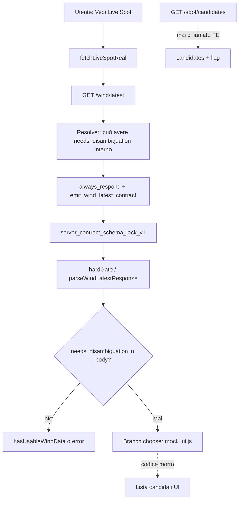

# AUDIT ARCHEOLOGICO — RESTORE DISAMBIGUAZIONE LIVE SPOT V1

**Data:** 2026-05-27  
**Root analizzato:** `/Users/PER_TEST/raccolta_dati_K_test`  
**Modalità:** AUDIT ONLY — nessuna modifica runtime/UI/server/API/payload/deploy/commit.

**Esempio guida:** Grado (Italia) · Grado (Spagna) · El Grado (Spagna) — il geocoder multilingua documenta esplicitamente che «Grado → resta ambiguo, utente sceglie».

---

## 1. Cosa dice la Bibbia

| Fonte | Affermazione |
|-------|----------------|
| `BIBBIA_PROBLEMI_UX_20260509.md` (PRODUCTION LOCK V1) | Problema aperto #3: «UI prevede `needs_disambiguation` su `/wind/latest`; API usa `/spot/candidates` separato — allineare o rimuovere branch.» |
| `_handoff_server_live_spot/20260506_geocoder_multilang/README_GEOCODER_MULTILANG.txt` | `geocode_candidates()` migliora `/spot/candidates`; **mantiene** `needs_disambiguation` con più candidati; **Grado resta ambiguo** — scelta utente. |
| `_handoff_server_live_spot/20260506_candidate_metadata/README_CANDIDATE_METADATA.txt` | Metadata candidati **senza** alterare `needs_disambiguation`. |

**Principio storico:** il Cervello allarga la ricerca geocoder, **non decide** al posto dell’utente su omonimi geografici.

---

## 2. Risposte alle 7 domande

### 1) La UI ha mai avuto un chooser/disambiguazione?

**Sì.** Implementazione completa lato frontend:

- Testi i18n (`wind_ui_disambiguation_prompt`) in `translations.js` (6 lingue).
- Stili dedicati in `styles.css` (`.live-spot-candidate-*`).
- Logica click handler in `mock_ui.js` (righe ~2049–2104): lista fino a 5 pulsanti; al click rifà fetch con `candidate` (lat/lon).

### 2) Il codice esiste ancora ma è scollegato?

**Sì — vivo nel sorgente, morto nel percorso dati reale.**

| Componente | Stato |
|------------|--------|
| `mock_ui.js` branch `needs_disambiguation` | **Presente** — non rimosso |
| CSS + i18n | **Presenti** |
| `fetchLiveSpotReal` → solo `/wind/latest` | **Non chiama** `/spot/candidates` |
| `live_spot_wind_adapter_v1.js` + `server_contract_passive_v1.js` | **Scollegano** il branch: accettano solo `server_contract_schema_lock_v1` con `display.*` |

Il chooser **non può attivarsi** con la catena PRODUCTION LOCK attuale: la risposta API non passa mai `needs_disambiguation` al consumer.

### 3) Il server/endpoint supportava o supporta ancora needs_disambiguation/candidates?

**Sì, su due canali diversi (handoff / patch emergenza):**

| Endpoint | Contratto disambiguazione |
|----------|---------------------------|
| **`GET /spot/candidates?q=`** | Restituisce esplicitamente `{ needs_disambiguation, candidates[] }` (`app_wind_wrapper_patch.py` L119–138). **Nessun** PRODUCTION LOCK kernel su questo endpoint. |
| **`GET /wind/latest?spot=`** (resolver interno) | `LiveSpotResolver.resolve()` può restituire `cache: "needs_geo_disambiguation"`, `needs_disambiguation: true`, `candidates` (`resolver.py` L211–226 in handoff `20260506_forecast_resolved_sources`). |
| **`GET /wind/latest` uscita pubblica** | `emit_wind_latest_contract()` → **solo** `server_contract_schema_lock_v1` — **nessun campo** `needs_disambiguation` / `candidates` nel contratto lock (`zero_drift_kernel_v1.py`, `server_contract_schema_lock_v1.py`). |

**Conclusione:** capacità server **esiste** nel resolver e in `/spot/candidates`; la **facciata pubblica** `/wind/latest` dopo PRODUCTION LOCK **non la espone più**.

### 4) La risposta viene normalizzata e poi persa?

**Sì — è il punto di rottura principale.**

Flusso attuale:

```
Utente clicca «Vedi Live Spot»
  → fetchLiveSpotReal(spot) → GET /wind/latest?spot=...
  → body: server_contract_schema_lock_v1
  → parseWindLatestResponse → hardGate(body)
  → accetta solo contract_version lock + display completo
  → needs_disambiguation / candidates MAI presenti
```

Se il resolver interno era in stato disambiguazione, `always_respond_wind_contract_v1.py` può tentare arricchimento Open-Meteo quando `cache == "needs_geo_disambiguation"` (L208–212), **mascherando** l’ambiguità con vento stimato invece di restituire chooser.

### 5) Il problema è nel render, adapter, state, i18n o contratto?

| Layer | Ruolo nel bug |
|-------|----------------|
| **Contratto** | **Primario** — PRODUCTION LOCK elimina `needs_disambiguation` da `/wind/latest`. |
| **Adapter** | **Primario** — `parseWindLatestResponse` / `hasUsableLiveSpotData` ignorano disambiguazione. |
| **Fetch orchestration** | **Primario** — nessuna chiamata a `/spot/candidates`. |
| **Render chooser** | **OK** — codice presente ma irraggiungibile. |
| **i18n** | **OK** — stringhe pronte. |
| **CSS** | **OK** — stili pronti. |
| **State / payload submit** | **Non coinvolti** — disambiguazione non tocca `LegacyPayload` né DAM. |

### 6) File coinvolti in patch minima futura

| File | Azione consigliata |
|------|-------------------|
| `ui-lab/mock-ui/mock_ui.js` | Orchestrazione: prima `/spot/candidates` o ramo pre-wind; poi `/wind/latest?lat&lon` dopo scelta. |
| `ui-lab/mock-ui/live_spot_wind_adapter_v1.js` (o nuovo `geo_disambiguation_adapter_v1.js`) | Parser risposta `/spot/candidates` separato dal lock contract. |
| `ui-lab/mock-ui/ventolive_api_routing_v1.js` | Già supporta `lat`/`lon` su `canonicalWindLatestUrl` — **riusare**. |
| `translations.js` | Nessun cambio necessario (già ok). |
| `styles.css` | Nessun cambio necessario. |
| `server_contract_passive_v1.js` | **Evitare** di indebolire hardGate; disambiguazione **prima** del lock. |
| `index.html` | Solo se si aggiunge nuovo script adapter (ordine prima di `mock_ui.js`). |

**Non necessari per patch UI minima:** `static_data.js`, `mock_engine.browser.js`, payload submit, WhatsApp, Google secondary.

### 7) Rischio minimo per ripristino senza rompere DAM/payload/submit

| Rischio | Mitigazione |
|---------|-------------|
| DAM / payload / submit | **Zero** se la patch resta nel ramo Live Spot (`showLiveSpot` click) e non tocca `buildMockPayloads` / `submitSession*`. |
| PRODUCTION LOCK vento | **Basso** se dopo la scelta si usa solo `/wind/latest?spot=&lat=&lon=` → stesso contratto lock attuale. |
| Server resolver | **Nessuna modifica obbligatoria** — `/spot/candidates` già esiste. |
| Grado / omonimi | Test manuale: `q=Grado` su candidates → chooser → wind con coordinate scelte. |

---

## 3. Evidenze per file (vivo / morto / scollegato)

### Frontend — VIVO ma irraggiungibile

**`ui-lab/mock-ui/mock_ui.js`**

```654:691:ui-lab/mock-ui/mock_ui.js
async function fetchLiveSpotReal(spot, candidate) {
  // ...
  let url = routing.canonicalWindLatestUrl(spot, candidate);  // lat/lon se candidate
  // ...
  return await adapter.parseWindLatestResponse(res);
}
```

```2049:2104:ui-lab/mock-ui/mock_ui.js
if (realData.needs_disambiguation && Array.isArray(realData.candidates) && realData.candidates.length) {
  // intro + .live-spot-candidate-button per ogni candidate
  // click → fetchLiveSpotReal(spot, candidate) → render lock contract
}
```

- `hasUsableLiveSpotData` tratta `needs_disambiguation` come “usable” (L2030) ma il body reale **non lo contiene mai** dopo adapter.

**`ui-lab/mock-ui/ventolive_api_routing_v1.js` L18–28** — `canonicalWindLatestUrl(spot, queryExtra)` aggiunge `lat`/`lon`: **pronto** per fase post-scelta.

**`ui-lab/mock-ui/live_spot_wind_adapter_v1.js` L10–26** — `parseWindLatestResponse` → `hardGate` → solo lock contract.

**`ui-lab/mock-ui/server_contract_passive_v1.js` L55–63, L131–134** — `isLockContract` / `hasUsableWindData` richiedono `data_state` `full`|`partial`, non disambiguazione.

**`translations.js`** — `wind_ui_disambiguation_prompt` (IT: «Scegli la località corretta: ») — **vivo**.

**`styles.css` L1163–1227** — stili chooser — **vivo**.

**`index.html` L282–292** — script chain PRODUCTION LOCK — **nessun** riferimento disambiguazione (corretto per lock, incompatible con branch legacy).

### Frontend — assente / non usato

| Path | Esito grep |
|------|------------|
| `ui-lab/mock-ui/static_data.js` | Nessuna disambiguazione |
| `ui-lab/mock-engine/mock_engine.browser.js` | Nessuna disambiguazione spot |
| `index.html` | Nessun `needs_disambiguation` |
| Repo intero | **`/spot/candidates` citato solo in handoff + Bibbia** — **zero chiamate fetch FE** |

### Server (handoff reference — non modificato in audit)

**`app_wind_wrapper_patch.py`**

- L73–116: `/wind/latest` → `emit_wind_latest_contract` (no candidates in output).
- L119–138: `/spot/candidates` → `needs_disambiguation`, `candidates` da `geocode_candidates`.

**`resolver.py` (handoff 20260506)**

- L201–226: ramo `geo_unsafe` → `geocode_candidates` → return con `needs_disambiguation: True`.

**`providers.py` (geocoder multilang)**

- Candidati con `label`, `lat`, `lon`, `name`, ranking; dedup; Grado documentato ambiguo.

**`always_respond_wind_contract_v1.py` L208–212**

- `needs_geo_disambiguation` in set cache che innesca fallback Open-Meteo — rischio **silenzioso** (vento senza chooser).

---

## 4. Diagramma flusso (stato attuale)



---

## 5. Cosa è vivo / morto / scollegato (sintesi)

| Pezzo | Verdetto |
|-------|----------|
| UI chooser (JS + CSS + i18n) | **Vivo nel repo, scollegato dal wire** |
| `/spot/candidates` server | **Vivo (handoff), FE non lo usa** |
| Resolver `needs_disambiguation` | **Vivo lato engine, perso su uscita lock** |
| PRODUCTION LOCK `/wind/latest` | **Vivo — sostituisce contratto disambiguazione** |
| Payload submit / DAM | **Non impattati** (mai avuto disambiguazione) |

---

## 6. Patch minima consigliata (NON implementata)

**Strategia a rischio minimo: «candidates first, wind second»**

1. Su click «Vedi Live Spot», se spot non vuoto:
   - `GET https://api.ventolive.com/spot/candidates?q={spot}` (nuova funzione, **non** passa da `hardGate`).
2. Se `needs_disambiguation && candidates.length > 1`:
   - riusare blocco UI esistente in `mock_ui.js` (stessi classi CSS / i18n).
3. On candidate click:
   - `GET /wind/latest?spot={spot}&lat={candidate.lat}&lon={candidate.lon}` (già supportato da routing + resolver `confirmed_lat/lon`).
   - flusso PRODUCTION LOCK invariato dopo la scelta.

**Alternativa più invasiva (sconsigliata per V1):** estendere `server_contract_schema_lock_v1` con `extensions.geo_disambiguation` e aggiornare `hardGate` — tocca kernel/enforcer/test lock.

### Cosa NON toccare

- `app.py` / `resolver.py` / `catalog.py` / `cache_db.py` / `providers.py` su server produzione (salvo deploy separato già pianificato).
- `buildMockPayloads`, `submitSessionPrimary`, `LegacyPayload`, campi `spot.location` value.
- `zero_drift_kernel_v1.py` / enforcer (se si segue strategia candidates-first).
- MutationObserver / custom select form (track separata Bibbia form).

---

## 7. Test read-only eseguiti

- `grep` / ricerca su root `raccolta_dati_K_test` per: `needs_disambiguation`, `disambiguation`, `/spot/candidates`, `canonicalWindLatestUrl`, `Grado`, `live-spot-candidate`.
- Lettura mirata: `mock_ui.js`, adapter, passive gate, `app_wind_wrapper_patch.py`, `resolver.py`, README geocoder.

**Nessun** `pytest`, deploy, commit, modifica file applicativa.

---

## 8. Prossimo passo (solo proposta)

Implementare **solo** orchestrazione FE `spot/candidates` → chooser esistente → `wind/latest` con lat/lon; validare con `Grado` e spot noti; lasciare PRODUCTION LOCK intatto per il render vento post-scelta.
